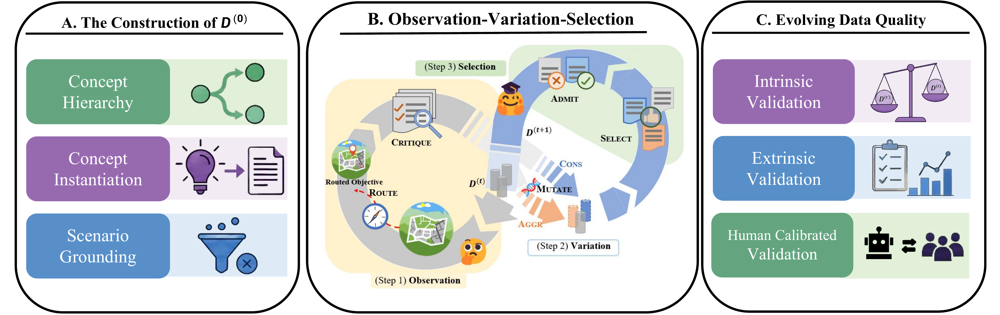

# Agentic Data Evolution

<p align="center">
  <a href="README.md">English</a> | <a href="README-zh.md">简体中文</a>
</p>

The official implementation of the paper "ADE: Agentic Data Evolution Framework for Human-Centered Objectives".

## Overview

Aligning large language models to human-centered objectives is difficult when targets are non-executable and context-dependent. Agentic Data Evolution (ADE) treats synthetic supervision as a sequence of evolving data snapshots and improves those snapshots through a closed-loop Observation-Variation-Selection (OVS) procedure. A steady-state admission mechanism conservatively gates updates for sustained cross-round improvement.



The repository exposes construction, evolution, training process, and evaluation as separate stages so that users can connect their own models, endpoints, and compute environments.

## Repository Layout

```text
.
├── src/
│   ├── construction/        # D(0) and DEV300 construction
│   ├── ovs/                 # Observation, Variation, Selection, and coordination
│   └── evaluation/          # Prediction generation and benchmark scoring
├── data/                    # Evaluation examples and data instructions
└── scripts/                 # Construction, OVS, and SFT launchers
```

## Requirements

- Python 3.10 or newer.
- One or more OpenAI-compatible endpoints for D(0) construction, OVS, prediction generation, or automatic judging, depending on the stage being run.
- `requirements.txt` installs the core dependencies for D(0) construction, OVS, and evaluation.
- SFT is optional and requires `ms-swift`. Our training runs were conducted on a node with 8 NVIDIA H100 GPUs.

Create an environment and load your own endpoint configuration:

```bash
python -m venv .venv
source .venv/bin/activate
pip install -r requirements.txt
cp .env.example .env
# Edit .env and replace every placeholder with your own values.
set -a
source .env
set +a
```

The environment template contains separate settings for D(0) construction, OVS, evaluation judges, and served/reference-model prediction generation. The `CONVERT_*` variables are set per run in the Quick Start section. Do not commit `.env` or real credentials.

## Quick Start

Run the commands from the repository root. The stages are independent, but a full pipeline normally follows the order D(0) construction, OVS, SFT, and evaluation.

### 1. Construct `D(0)`

```bash
bash scripts/generate_d0.sh \
  --output-dir data/construction/raw \
  --model "$D0_MODEL" \
  --api-key "$D0_API_KEY" \
  --base-url "$D0_BASE_URL" \
  --prompt-language "$D0_PROMPT_LANGUAGE"
```

This writes `D0.jsonl`, `DEV300.jsonl`, and `construction_manifest.json`. Use `D0.jsonl` as OVS input for data destined for SFT, and keep `DEV300.jsonl` held out for intrinsic evaluation.

### 2. Evolve a dataset with OVS

`run_ovs.sh` reads every JSONL file under `OVS_INPUT_DIR` and writes evolved snapshots under the configured output directory.

```bash
mkdir -p data/ovs_input
cp data/construction/raw/D0.jsonl data/ovs_input/

export OVS_INPUT_DIR=data/ovs_input
export OVS_OUTPUT_DIR=/path/to/evolution
export OVS_LOG_FILE=/path/to/ovs.log
export OVS_ROUNDS=4
bash scripts/run_ovs.sh
```

Keep `DEV300.jsonl` outside `OVS_INPUT_DIR`; it is reserved for held-out evaluation.

The final snapshot is written to `$OVS_OUTPUT_DIR/round$OVS_ROUNDS/data/`.

### 3. Convert a snapshot and run SFT

Convert the evolved snapshot to OpenAI chat-message JSONL, then launch full-parameter SFT:

```bash
export CONVERT_INPUT_DIR=/path/to/evolution/round4/data
export CONVERT_OUTPUT_DIR=/path/to/sft_data
python src/to_oai_msg.py

bash scripts/run_sft.sh \
  7b \
  /path/to/Qwen2.5-7B-Instruct \
  /path/to/sft_data/D0.jsonl \
  /path/to/checkpoint
```

Use `72b` instead of `7b` for the 72B launcher. The scripts train a checkpoint only; they do not serve the checkpoint or run evaluation.

### 4. Generate and evaluate predictions

Expose the two snapshots or models being compared through OpenAI-compatible APIs, then generate both prediction files. Both files must contain the same example IDs and an `answer` field.

Generate predictions for the model being evaluated:

```bash
python src/evaluation/llm_gen.py \
  --model "$SERVED_MODEL_NAME" \
  --api_key "$SERVED_MODEL_API_KEY" \
  --base_url "$SERVED_MODEL_BASE_URL" \
  --inp_file data/dev300/example.jsonl \
  --out_file results/predictions.jsonl
```

Generate the reference predictions with the second snapshot or model:

```bash
python src/evaluation/llm_gen.py \
  --model "$REFERENCE_MODEL_NAME" \
  --api_key "$REFERENCE_MODEL_API_KEY" \
  --base_url "$REFERENCE_MODEL_BASE_URL" \
  --inp_file data/dev300/example.jsonl \
  --out_file results/reference_predictions.jsonl
```

The repository does not include `results/reference_predictions.jsonl`; create it with the command above before running the automatic judge. The two generated files are aligned by `id`.

```bash
python src/evaluation/eval_dev300.py \
  --inp_file results/predictions.jsonl \
  --ref_file results/reference_predictions.jsonl \
  --out_file results/eval.jsonl \
  --model "$JUDGE_MODEL" \
  --api_key "$JUDGE_API_KEY" \
  --base_url "$JUDGE_BASE_URL"
```

DEV300 and EduBench use an LLM judge. MATH-500 and ToxiCN use deterministic scoring. The complete external-data instructions, input fields, benchmark licenses, and evaluator-specific commands are documented in [data/README.md](data/README.md).

## Citation

If you use this repository, please cite:

```bibtex
@misc{yu2026agentic,
  title     = {Agentic Data Evolution},
  author    = {Yu, Yang and Jiang, Yilin and Fei, Zexuan and Luo, Yiming and
               Song, Xingkai and Huang, Kaiyi and Zhou, Aimin and Lin, Xin and
               Tan, Fei},
  year      = {2026},
  url       = {https://github.com/ZeroLoss-Lab/Agentic-Data-Evolution}
}
```

Please also cite the benchmark papers listed in [data/README.md](data/README.md) when using their data.

## License

The original source code is released under the MIT License. See [LICENSE](LICENSE) for the full text. Example data and derived benchmark files may be subject to separate upstream licenses; see [data/README.md](data/README.md) before redistributing them.
